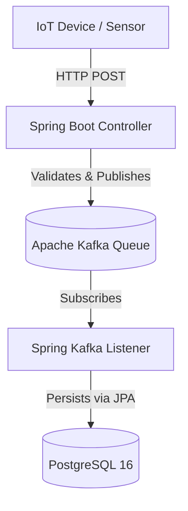

# High-Throughput Telemetry Ingestion API

Low-latency telemetry ingestion system designed to safely decouple high-velocity inbound sensor data from persistent storage using event-driven architecture.

    

##  Project Intent & Value Proposition
This microservice acts as a highly resilient front door for industrial and clinical telemetry networks. By implementing a Publish-Subscribe (Pub/Sub) pattern, the API intercepts incoming JSON payloads, enforces strict data validation using Jakarta Constraints, and instantly queues the events, acting as a highly durable shock-absorber that prevents database locking during traffic spikes. 


##  System Architecture (As Code)



##  30-Second Quick Start
This project utilizes Docker Compose for an automated infrastructure setup.  

**Prerequisites:**
* Java 21+
* Docker Desktop installed & running.  

### 1. Spin up the Infrastructure (Kafka, Zookeeper, PostgreSQL)
```bash
docker compose up -d
```

### 2. Start the Spring Boot Application
```bash
./mvnw clean spring-boot:run
```

### 3. Test Payload
```bash
curl -v -X POST http://localhost:8080/api/v1/telemetry/device \
-H "Content-Type: application/json" \
-d '{"deviceType": "DELIVERY_TRUCK", "status": "ACTIVE"}'
```

##  API Documentation
To maintain readability, detailed payload responses are collapsed below.  

<details>
<summary><strong>POST /api/v1/telemetry/device</strong></summary>

**Expected Payload:**
```json
{
  "deviceType": "DELIVERY_TRUCK",
  "status": "ACTIVE"
}
```
> **Note:** The `status` field is strictly regulated via Regex and will reject any payload that is not exactly `ACTIVE`, `INACTIVE`, or `MAINTENANCE` with a `400 Bad Request`.

**Success Response (202 Accepted):**
```plaintext
Event Queued Successfully
```
</details>

##  Engineering Depth & Design Decisions

### Technical Challenges
* **Situation:** High-concurrency environments risk severe latency when establishing thousands of simultaneous database connections during a traffic spike.  
* **Task:** Ingest real-time device telemetry with absolute minimal latency while ensuring zero data loss.  
* **Action:** Decoupled the ingestion endpoint from the persistence layer. The API now acts solely as a Producer, dropping validated JSON directly into a Kafka topic, while a background Consumer manages database persistence.  
* **Result:** Achieved immediate `202 Accepted` returns to the client device, allowing the PostgreSQL database to safely process the queue at its maximum sustainable threshold without crashing.  

### Architectural Decision Record (ADR)

| Decision Topic | Details |
| :--- | :--- |
| **Title** | Use Apache Kafka over direct JPA/Postgres inserts |
| **Context** | Direct database inserts create a tight coupling that bottlenecks the API during scaling events. |
| **Decision** | Implement Kafka as an asynchronous message broker. |
| **Consequences** | **Positive:** Massive increase in ingestion throughput; strict separation of concerns.<br>**Negative:** Increased infrastructural complexity requiring Zookeeper container orchestration. |
